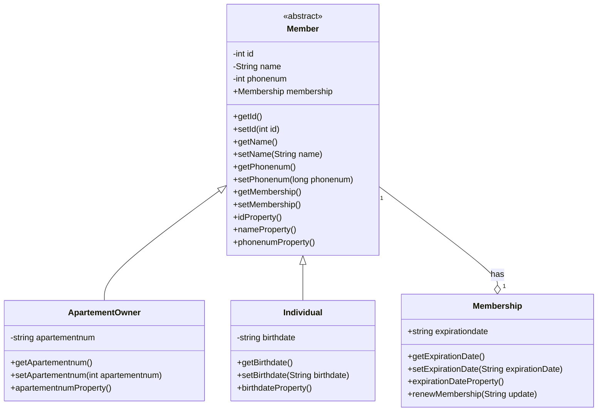
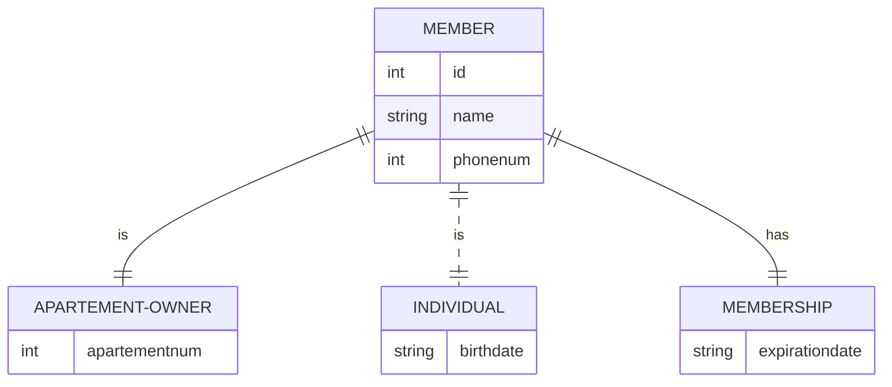
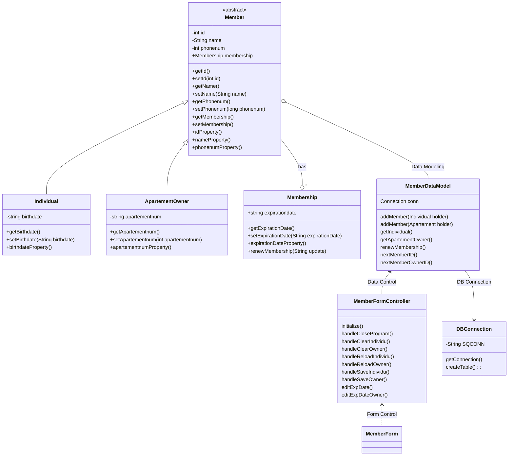

# Final Project Mata Kuliah Pemrograman Berorientasi Objek
Nama Anggota Kelompok :
- 1917051022 Hans Christian Herwanto 
- 1917051024 Ardella Dean Awalia     
- 1917051059 Raymond Faraz Yandika   

##   Member Account Application
---
> Sistem untuk arsip data anggota suatu fasilitas apartemen (fitness/gym misalnya) yang berisi ID (nomor anggota), Nama Lengkap, Nomor Telepon, tanggal lahir, dan tanggal habis masa keanggotaan, dan nomor apartement (bagi anggota yang memiliki unit di apartemen tersebut). 
---
Librari dan Tools yang digunakan dalam project ini :
- NetBeans IDE
- sqlite-jdbc-3.34.0.jar
- SQLite Studio
- Scene Builder
- Microsoft Visual Studio extensions :
  - Markdown All in One
  - Markdown Preview Enchanced
  - Live Server

#   Desain
> Untuk melihat diagram di bawah, install plugin mermaid-diagram di  https://github.com/Redisrupt/mermaid-diagrams

##   Class Diagram
---

##   ER Diagram
---

##   Design Class Diagram for JavaFX and Database
---
